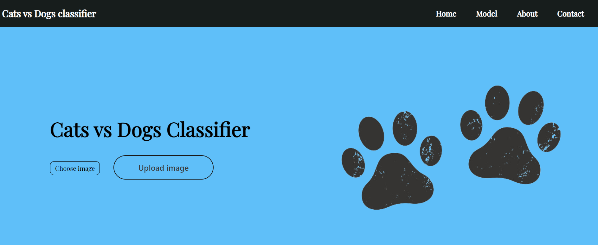

# Cats vs Dogs: A Deep Learning Showdown 🐱🆚🐶

## Overview

This project showcases a deep learning model trained to classify images of dogs and cats with high precision and recall rates. This deep learning model is trained on a massive dataset of over 22,000 images sourced from Microsoft, making it a fierce competitor in the world of image classification.

### 🚀 Key Features:
- **VGG16 Architecture**: Built on the powerful VGG16 architecture, this model can capture the most intricate features in images, ensuring accurate classification.
- **Stunning Performance**: With a precision rate of 96%, a recall rate of 95%, and an F1 score of 96%, this model is a top performer in identifying cats and dogs.
- **Easy to Use**: Simply clone the repository, install the dependencies, and start classifying images like a pro!

### 📈 Performance Metrics:
- **Precision**: 96%
- **Recall**: 95%
- **F1 Score**: 96%

### 🖼️ Website homepage:

### 💻 Usage:
1. **Clone the Repository**: `git clone https://github.com/Acva11235/dogs-vs-cats.git`
2. **Install Dependencies**: `pip install -r requirements.txt`
3. **View the Training process**: `python making_model.py`
4. **Use the trained model**: `ImageClassifier_95.h5`
5. **Classify Images**: Code can be found inside `model_metrics.py`

### 🙌 Acknowledgements:
- **Dataset**: Microsoft [Dataset Link](https://www.kaggle.com/datasets/shaunthesheep/microsoft-catsvsdogs-dataset)
- **Built with**: TensorFlow and Keras

### 📝 Author:
Achintya Varshneya

Ready to take your pet classification game to the next level? Clone our repository and dive into the world of deep learning with cats and dogs!
